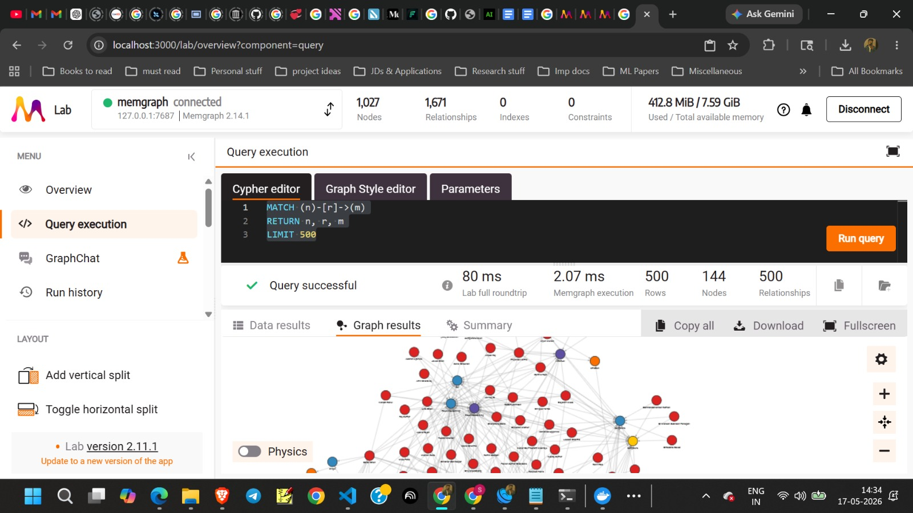

# SignalRank

## Goal
This prototype takes natural language queries from `data/queries.csv`, finds the most relevant people from `data/random_actors.json`, and writes the ranked output to `outputs/results.json`.

## How to Run
Install the dependencies, start Memgraph, and run the pipeline:

```bash
pip install -r requirements.txt
docker compose up -d
python -m src.main
```

OpenRouter is optional. Memgraph is used for the graph retrieval layer.

After `docker compose up -d`, the Memgraph UI is available at:

`http://localhost:3000`

That lets a reviewer inspect the graph directly after running `python -m src.main`.

Example view from Memgraph Lab after loading the graph and running a verification query:



## Architecture
The retrieval flow is:

`queries -> query parser -> HNSW vector retrieval + Memgraph graph retrieval -> graph-aware reranker -> JSON output`

I chose a hybrid design because the task contains two different retrieval problems at once:
- fuzzy semantic intent, such as “someone who can mentor me for my startup for vison stuff”
- exact relationship constraints, such as “worked at Google” or “founders in San Francisco”

Using only embeddings would be weak for exact relationship matching, and using only graph matching would be weak for open-ended semantic intent. The hybrid design separates those two jobs cleanly.

For each query, the system:
- parses the query into structured signals such as location, company, role, domain, and intent
- retrieves semantically similar actors with HNSW over one embedding per actor
- retrieves exact relationship matches from Memgraph
- combines those signals in a deterministic ranker and writes the results to JSON

## Actor Transformation
- Raw nested JSON is flattened from `profile`, `professional.current_position`, `work_experience`, `education`, and accomplishments.
- A field-labeled `search_text` document is created instead of embedding raw JSON directly.
- Rule-based tags and signals are generated from the combined profile text.
- One normalized actor document is created per person.
- Graph edges are created from profile relationships.
- Actor IDs are taken from source IDs when available. If two profiles resolve to the same source ID, a deterministic suffix is added so they remain separate actors in results and graph storage.

Each transformed actor includes:
- `actor_id`
- `name`
- `location`
- `normalized_location`
- `headline`
- `bio`
- `current_title`
- `current_company`
- `companies`
- `titles`
- `education`
- `schools`
- `raw_text`
- `search_text`
- `tags`

I chose a field-labeled profile document instead of raw JSON because it is easier for both retrieval systems to use:
- the embedding model receives a readable summary of the actor
- the graph layer receives normalized fields such as companies, schools, locations, and tags

This keeps the transformation explainable and reduces noise from irrelevant JSON structure.

## Embeddings and HNSW
Each actor vector is built from one profile document containing:
- name
- location
- headline
- bio
- current role
- work experience
- education
- accomplishments
- generated signals

I use one vector per actor because the retrieval target is a person, not a passage. I did not chunk individual jobs or education entries because the output needs a person-level ranking, and chunking would make the final score less interpretable.

The default local embedding model is `all-MiniLM-L6-v2`. HNSW is used for fast local semantic retrieval. The query vector is searched against actor vectors, and the HNSW distance is converted into a normalized `vector_score` between `0.0` and `1.0`.

## Graph Retrieval with Memgraph
Actor profiles are relational, not just textual. Each person connects to companies, locations, roles, domains, schools, and profile signals through graph edges such as `WORKED_AT`, `LOCATED_IN`, `HAS_ROLE`, `HAS_DOMAIN`, `HAS_SIGNAL`, and `STUDIED_AT`.

This graph layer handles exact relationship queries like:
- worked at Google
- founders in San Francisco
- marketing experts in fintech
- ML people in Bangalore
- mentor or advisor profiles with computer vision and startup signals

For each query, the graph retriever checks how many requested constraints an actor satisfies. Matching all requested constraints gives a graph score near `1.0`, partial matches get a lower score, and no matches get `0.0`.

This makes the graph score easy to defend: it is a direct measure of how many explicit query constraints were satisfied.

## Ranking
The final ranking score combines:
- vector score from HNSW semantic retrieval
- graph score from exact graph constraint matches
- structured boost score from rule-based query-aware matches

Weighted formula:

```txt
final_score =
  0.55 * vector_score
+ 0.35 * graph_score
+ 0.10 * structured_boost
```

Structured boosts are used for especially strong matches such as exact company matches, founder tags, exact location matches, and mentor or computer-vision intent.

I kept the ranking formula simple on purpose. The task rewards reasoning and clarity, so I preferred a small number of understandable signals over a more complicated scoring system.

## Why No BM25 / TF-IDF
I intentionally skipped BM25/TF-IDF because exact relational constraints are handled through the graph index, while fuzzy semantic intent is handled through the HNSW vector index. This separates structured matching from semantic similarity and keeps the retrieval logic explainable.

## Why No External Vector DB
The dataset is small, so a local HNSW index is enough for this prototype. The vector retrieval layer is modular and can later be swapped with Pinecone, Qdrant, or another vector database if the corpus grows.

## OpenRouter Usage
OpenRouter is optional only. It can be used in two separate ways:
- as an alternative embedding provider when `EMBEDDING_PROVIDER=openrouter`
- as an optional post-ranking explanation layer for `debug_results.json` through `OPENROUTER_EXPLANATION_MODEL`

Ranking itself stays local and deterministic.

## Example
For the query `Marketing experts in fintech`, a strong result is someone whose profile has marketing-heavy titles, fintech experience, graph matches for `HAS_ROLE -> marketing` and `HAS_DOMAIN -> fintech`, and supporting semantic similarity in the profile text. That is the intended behavior of the hybrid ranker: semantic retrieval narrows the field, graph retrieval enforces exact relationships, and structured boosts reward especially strong matches.

## Outputs
- `outputs/results.json`
- optional `outputs/debug_results.json`

For graph inspection in the Memgraph UI, a useful verification query is:

```cypher
MATCH (n)-[r]->(m)
RETURN n, r, m
LIMIT 100
```
